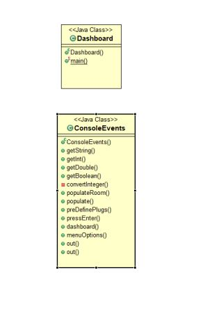
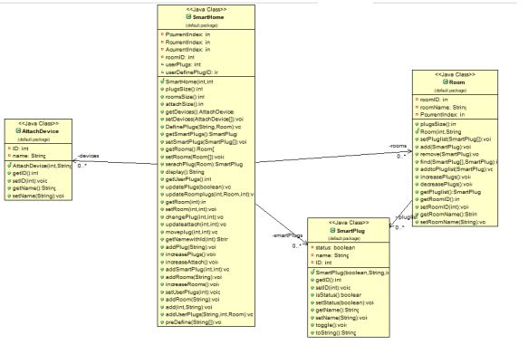
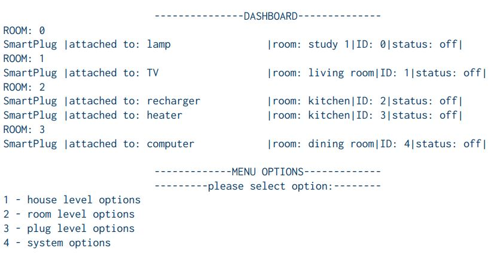

# Introduction
## Case Study

Alikoti, A UK-Finnish company, Required a smart Home console base dashboard which can have 
monitoring and controlling system for smart plugs in each room. Following constraints were pre-defined 
by company:
• The project must separate the responsibilities of backend objects and frontend objects.
• You can have zero, one or many smart plugs in a single room
• The application interface must be in the form of a Java console
• Less complexity
• Feasibility of further development.
• Easy Scaling up

# Implementation
To build a separate front end and back end implementation , a client server split architecture is 
used in building this Application. A complete separate split is done for back end implementation and 
frontend. Each module of application is developed keeping in view of company constraints.
For general overview:

#### Front end classes:

#### Back end classes:

# Dash Board Screen shot

# Menu Options

## House Level Options

For the house level actions there are two actions. All the
plugs can either be switched on or off. 
For example:
HOUSE LEVEL OPTIONS

>>1 - Switch all plugs off
2 - Switch all plugs on
Select an option
 2
 
After the specific house level option has been selected the
console  return to the main dashboard with updated
data from the backend objects displayed.

## Room level Options

For the room level options select a room. With a selected room you are given 3 actions for the
plugs in that room. 
For example:
>>ROOMS AVAILABLE: 0 - study 1 | 1 - living room | 2 -
kitchen | 3 - dining room |
Please select room (integer only)
2
SmartPlug |attached to: recharger |room: kitchen|ID:
2|status: on|
SmartPlug |attached to: heater |room: kitchen|ID:
3|status: on|
ROOM LEVEL OPTIONS
1 - Switch all plugs off in room
2 - Switch all plugs on in room
3 - Select a plug in the room and toggle its on/off status
Select an option
 1

After the room level option has been selected the console
should return to the main dashboard with updated data
displayed.

## Smart Plug Level Options
For the plug level options you have given a room
independent listing of the plugs. From this list you canshould be
select a smart plug from its ID. 
For example:
>>SmartPlug |attached to: lamp |room: study 1|ID: 0|status:
on
SmartPlug |attached to: TV |room: living room|ID:
1|status: on
SmartPlug |attached to: recharger |room: kitchen|ID:
2|status: off
SmartPlug |attached to: heater |room: kitchen|ID:
3|status: off
SmartPlug |attached to: computer|room: dining room|ID:
4|status: on
Please select plug (integer only)
1
PLUG LEVEL OPTIONS
1 - Switch plug off
2 - Switch plug on
3 - Change attached device
4 - Move plug to different room
Select an option
3

For the change attached device action you can see
listing of the available devices to allow the user to select a
different attached device. 
For example:
>>AVAILABLE DEVICE LIST OPTIONS
These are standard devices attached to the smart plug,
unless otherwise stated
1-Lamp
2-TV
3-Computer
4-Phone Recharger
5-Heater
Enter device to attach to smart plug (integer only)
1

For the move plug to different room action you have given
a listing of available rooms to allow the user to select a
different room for the plug. 
For example:
>>ROOMS AVAILABLE: 0 - study 1 | 1 - living room | 2 -
kitchen | 3 - dining room |
Please select room for device from list (integer only)

## System level Options

The system options allow (a) more smart plugs to be added,
(b) more attached devices to be listed and (b) more rooms to
be added.

## Logic
Firstly for front end, dashboard class which have main of application handles user interface with 
the help of ConsoleEvents Class, which have responsibility of handling user input and giving output to users.

When programs starts, User enter Number of rooms in property and number of plugs he want in 
property which store in 2 arrays in SmartHome class name smartsPlugs androoms. Application has pre define Plugs.

Each plug and room has unique ID which is stored dynamically when user add room and when pre define plugs added to array. To keep track of each room plug, array list has been used in ROOm class which store list of smartplug objects. So when user assign Plug to any room its instance is stored or added in that room object list

Now to retrieve rooms and its corresponding plugs, we just iterate through rooms array and each room array list of smart plugs to display data.

To update any Field in class, ID concept is used which just compare IDs of corresponding item and update its data.

If user only want to view plugs that he has assigned to rooms or selected for his property, getRoom function is which returning Room ID of that plug ID otherwise -1.

Now if return id is -1, we simply ignore that plug from Smart Plug list to display only user property plugs which he has attached or user for his property.

Now if user want to move plug to any other room , we delete that plug from room list and add to new room list object

# Conclusion:
Keeping in view of company constraints, This Application can be scale up or can be modify as per their new needs. Each constraint or requirement is followed to build this Application so that it can be scale up to any need of company. For implementation, Client server split architecture can be helpful for any error tracing in future